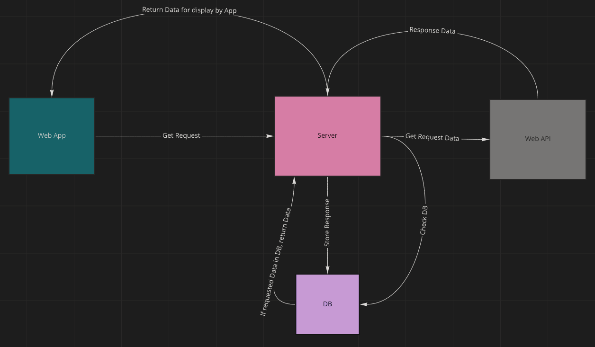

# Vision

## What is the vision of this product?
- Find new recipes and save those recipes to your favorites. Create shopping list. Filter recipes. Login/Logout

What pain point does this project solve?
- Finding new recipes, keeping track of ingredients, and listing out ingredients for tracking.

Why should we care about your product?
- Because you like food and need it to survive. You all want to find new recipes.

# Scope (In/Out)

## IN - What will your product do
- Landing page will require users to login, so that their favorites and shopping list can be tracked
- Main page will be where the user can filter/search for recipes
- Main page will also allow user to save items to favorites
- Shopping list will allow users to add ingredients to their shopping list from the recipes if they don't have the items at home

## OUT - What will your product not do.

### What will your MVP functionality be?
- A webpage where you can login, search recipes, and save recipes to favorites page

### What are your stretch goals?
- Shopping list
- Let user input ingredients they already have
- Pricing information by ingredients or recipe
- Paypal API
- Ability to "purchase" through the website

### Functional Requirements
- User can login
- User can view/add Favorites
- User can logout
- user can filter/search

### Data Flow
- Client <---> server <---> RecipeAPI <---> MongoDb
- User lands on the landing page
- User has to login
- user begins searching for recipes
- user can save recipes to their favorites
- User can logout or just exit browser

# Non-Functional Requirements (301 & 401 only)
Non-functional requirements are requirements that are not directly related to the functionality of the application but still important to the app.
 ## Testability
 - Our project will be testable for wether or not a user can add a recipe card to their favorites
 
 ## Security
 - User must login using Auth0 which will authenticate a user and save items to their login information
